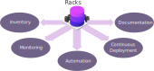

# RacksDB

## Overview

**RacksDB** is an _open source_ solution to modelize your datacenters
infrastructures. It provides a simple database schema to store information about
the equipments in your datacenters. This database can be used as **reference
source** for many purposes in IT management.

* **Inventory**: Get permanent reference list of equipments charactistics and
  enable conformity testing.
* **Automation**: Adopt Infrastructure-as-Code by coupling generic configuration
  management logic with infrastructures model.
* **Continuous deployment**: Define advanced deployment rules based on nodes
  characteristics declared in RacksDB.
* **Monitoring**: Synchronize monitoring services with equipments database and
  define dynamic dashboard.
* **Documentation**: Get updated architecture diagrams and define generic
  adaptative procedures.

<p align="center">
  
</p>

Generally speaking, **RacksDB** is a specialized
[CMDB](https://en.wikipedia.org/wiki/Configuration_management_database)
dedicated to
[DCIM](https://en.wikipedia.org/wiki/Data_center_management#Data_center_infrastructure_management).

Compared to others products, **RacksDB** can be considered lightweight
alternative to more advanced tools such as [NetBox](https://netbox.dev/) and
[RackTables](https://www.racktables.org/).

The main characteristics of **RacksDB** that makes it unique among other
solutions are the following:

* **YAML based.** The data are stored in plain files using human-readable YAML
  format, easily managed with Git.
* **Simple and pragmatic.** The database schema is intuitive and practical,
  infrastructures can be described in few minutes.
* **Tag-based.** Easy filtering of data and equipments based on associated tags.
* **Decentralized architecture.** RacksDB can be deployed without central
  server, just by replicating few plain YAML files.
* **Extensibility.** In addition to RacksDB simple format, custom schema
  extensions can be defined to store specific data.

RacksDB provides multiple interfaces to request the database with its
[CLI tool](https://docs.rackslab.io/racksdb/beta/usage/racksdb.html), a
[Python library](https://docs.rackslab.io/racksdb/beta/usage/api.html) and a
[REST API](https://docs.rackslab.io/racksdb/beta/usage/rest.html).

For more details, read the
[full description](https://docs.rackslab.io/racksdb/beta/overview/overview.html)
of RacksDB.

## Status

RacksDB is considered stable and ready for production.

## Quickstart

To install and start using RacksDB in a few steps, follow the
[quickstart guide](https://docs.rackslab.io/racksdb/beta/install/quickstart.html)!

## Documentation

The [full documentation](https://docs.rackslab.io/racksdb/beta/)
of RacksDB is available online with complete database definition reference
documentation, how-tos (extensions, positioning), CLI manpage and library API
documentation.

## Tests

To run the unit tests, launch this command:

```
$ python3 -m unittest discover -v .
```

## Authors

RacksDB is developed and maintained by [Rackslab](https://rackslab.io). Please
[contact us](https://rackslab.io/en/contact/) for any questions or professionnal
services.

## License

RacksDB is distributed under the terms of the GNU General Public License v3.0 or
later (GPLv3+).
