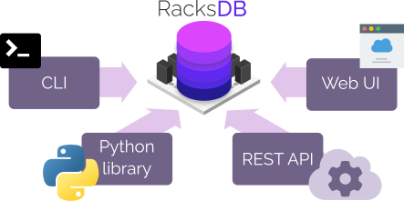
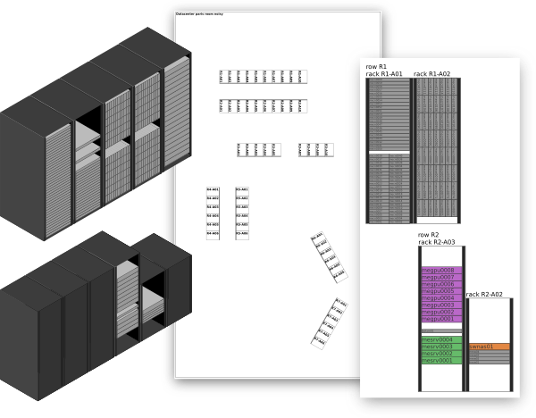

# RacksDB

## Overview


**RacksDB** is an _open source_ solution for modeling your datacenters
infrastructures. It provides a simple database schema to store information about
the equipments in your datacenters. This database can be used as **reference
source** for many purposes in IT management.

* **Inventory**: Get permanent reference list of equipments charactistics and
  enable conformity testing.
* **Automation**: Adopt Infrastructure-as-Code by coupling generic configuration
  management logic with infrastructures model.
* **Continuous deployment**: Define advanced deployment rules based on nodes
  characteristics declared in RacksDB.
* **Monitoring**: Synchronize monitoring services with equipments database and
  define dynamic dashboard.
* **Documentation**: Get updated architecture diagrams and define generic
  adaptative procedures.

<p align="center">
  
</p>

Generally speaking, **RacksDB** is a specialized
[CMDB](https://en.wikipedia.org/wiki/Configuration_management_database)
dedicated to
[DCIM](https://en.wikipedia.org/wiki/Data_center_management#Data_center_infrastructure_management).

Compared to others products, **RacksDB** can be considered lightweight
alternative to more advanced tools such as [NetBox](https://netbox.dev/) and
[RackTables](https://www.racktables.org/).

The main characteristics of **RacksDB** that makes it unique among other
solutions are the following:

* **YAML based.** The data are stored in plain files using human-readable YAML
  format, easily managed with Git.
* **Simple and pragmatic.** The database schema is intuitive and practical,
  infrastructures can be described in few minutes.
* **Tag-based.** Easy filtering of data and equipments based on associated tags.
* **Decentralized architecture.** RacksDB can be deployed without central
  server, just by replicating few plain YAML files.
* **Extensibility.** In addition to RacksDB simple format, custom schema
  extensions can be defined to store specific data.

RacksDB provides multiple interfaces with its
[CLI tool](https://docs.rackslab.io/racksdb/usage/racksdb.html), a
[Python library](https://docs.rackslab.io/racksdb/usage/lib.html), a
[REST API](https://docs.rackslab.io/racksdb/usage/rest.html) and a
[Web UI](https://docs.rackslab.io/racksdb/usage/ui.html).

<p align="center">

<p>

<p align="center">

<p>

RacksDB can generate graphical representations of your datacenter rooms and your
infrastructures with their racks and equipment, including axonometric views for
3D representations:

<p align="center">

<p>

These graphical representations can be generated in various formats (PNG, SVG,
PDF) and can be customized with many
[drawing parameters](https://docs.rackslab.io/racksdb/usage/drawparams.html).

For more details, read the
[full description](https://docs.rackslab.io/racksdb/overview/overview.html)
of RacksDB.

## Status

RacksDB is considered stable and ready for production.

## Quickstart

To install and start using RacksDB in a few steps, follow the
[quickstart guide](https://docs.rackslab.io/racksdb/install/quickstart.html)!

## Documentation

The [full documentation](https://docs.rackslab.io/racksdb/)
of RacksDB is available online with complete database definition reference
documentation, how-tos (extensions, positioning), CLI manpage and library API
documentation.

## Community

Do you want to get in touch with developers and the community? Several channels
are available:

* **Matrix Chat** [#racksdb:talk.rackslab.io](https://matrix.to/#/#racksdb:talk.rackslab.io):
  instant messaging for quick feedback and help.

> [!NOTE]
> A [Matrix account](https://matrix.org/docs/chat_basics/matrix-for-im/#creating-a-matrix-account)
> is required to access the chat room. It can be created in few steps on any
> Matrix network public provider such as [matrix.org](https://matrix.org) or
> [gitter.im](https://gitter.im/#apps).

* [**GitHub Discussions**](https://github.com/rackslab/RacksDB/discussions):
  send questions, ideas and suggestions.

## Authors

RacksDB is developed and maintained by [Rackslab](https://rackslab.io). Please
[contact us](https://rackslab.io/en/contact/) for any questions or professionnal
services.

The project has also received external contributions from great people:

* [@btravouillon](https://github.com/btravouillon)
  ([Mila](https://mila.quebec/en/))

## Tests

To run the unit tests, launch this command:

```
$ python3 -m unittest discover -v .
```

Or:

```
$ pytest
```

## License

RacksDB is distributed under the terms of the GNU General Public License v3.0 or
later (GPLv3+).
